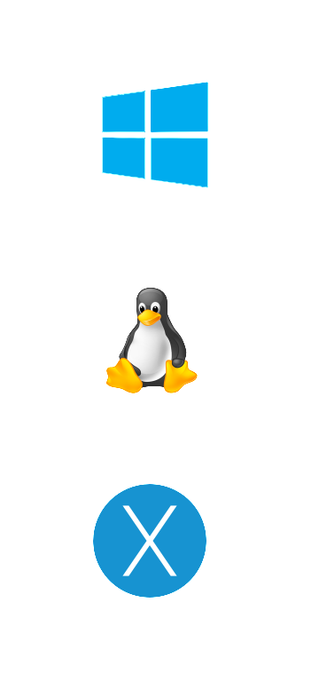
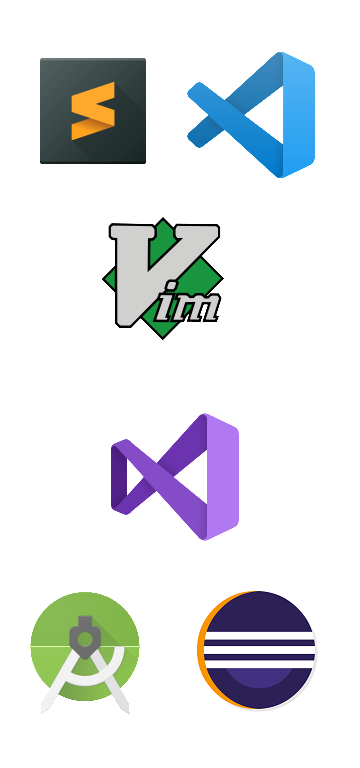
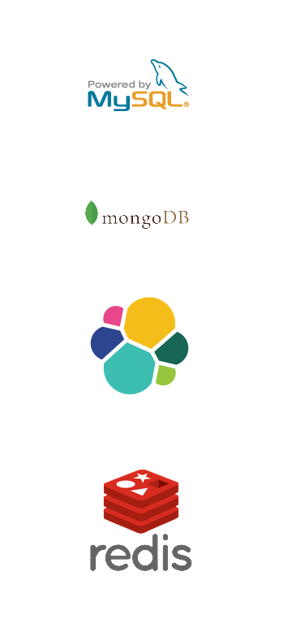
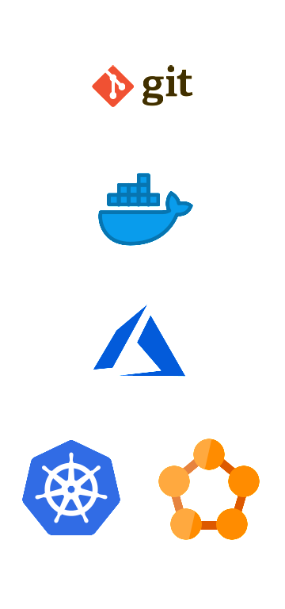
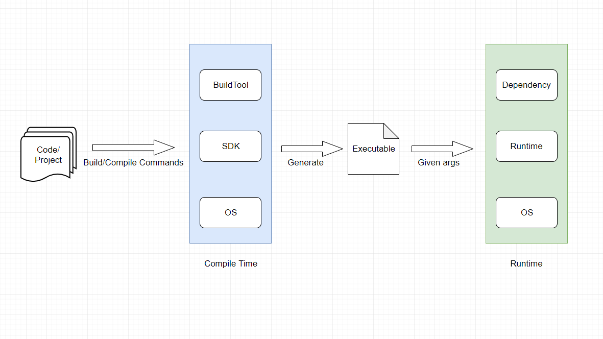

## Development Life Cycle & Docker

2019.11.29  Xianyi Cui

>Note: 1. 曾经对软件开发流程并没有觉得很清晰<br/> 2. 里面有一部分开发环境/UI的锅<br/>3. 理解流程有助于理解DevOps以及扩展开发中的方法论 <br/>4. 自己的思考学习过程

---
<!-- .slide: style="text-align: left;"> -->  
## Agenda
<li class="fragment">Software Development Life Cycle(SDLC)</li>
<li class="fragment">Environment in Development</li>
<li class="fragment">Docker</li> 
<li class="fragment">Workflow Review & Optimize</li> 
<li class="fragment">What's more</li> 

---

## Software Development Flow

>Note: 首先关注目前开发流程，并进行分析

---
<!-- .slide: style="text-align: left;"> -->  
### Current (.NET Framework)
<ol>
<li class="fragment">Request new Windows machine</li> 
<li class="fragment">Install <strong>Visual Studio</strong>, <strong>Git</strong></li> 
<li class="fragment">Install <strong>MySQL</strong>,<strong>SQL Server</strong>, <strong>ElasticSearch</strong>, <strong>Redis</strong>, <strong>MongoDB</strong></li> 
<li class="fragment">Install <strong>Azure SDK</strong>, <strong>Service Fabric SDK</strong></li> 
<li class="fragment">Pull code</li> 
<li class="fragment">Generate Dll(library)/Exe(executable)</li> 
<li class="fragment">Test executable or libary behaviour</li> 
<li class="fragment">Copy <strong>binary</strong> to others for usage/Use Azure SDK to deploy to Cloud</li> 
</ol>

***
<!-- .slide: style="text-align: left;"> -->  
### Current (.NET Core)
<ol>
<li class="fragment">Request new Windows/Linux machine</li> 
<li class="fragment">Install <strong>Visual Studio</strong>, <strong>Git</strong>, <strong>.NET Core SDK(Runtime included)</strong></li> 
<li class="fragment">Install <strong>MySQL</strong>,<strong>SQL Server</strong>, <strong>ElasticSearch</strong>, <strong>Redis</strong>, <strong>MongoDB</strong></li> 
<li class="fragment">Install <strong>Azure SDK</strong>, <strong>Service Fabric SDK</strong></li> 
<li class="fragment">Pull code</li> 
<li class="fragment">Generate Library Dll/Executable dll</li> 
<li class="fragment">Test executable or library behaviour</li> 
<li class="fragment">Copy <strong>binary</strong> to others for usage/Usage Azure SDK to deploy to Cloud</li> 
</ol>

***
<!-- .slide: style="text-align: left;"> -->  
### Current (Python)
<ol>
<li class="fragment">Request new Windows/Linux machine</li> 
<li class="fragment">Install <strong>Python</strong>, <strong>Git</strong>, <strong>VS Code</strong></li> 
<li class="fragment">Pull code</li> 
<li class="fragment">Test python file</li> 
<li class="fragment">Copy <strong>python file</strong> to others for usage</li> 
</ol>

---
#### Software Development Life Cycle


>Note: 按照agile的定义，我们Devloper更多关注的是Development -> Deployment的。再细分可以分为以下。

***
<!-- .slide: style="text-align: left;"> -->  
### Focus on Developer side

<li class="fragment highlight-blue" data-fragment-index="1">Prepare Environment</li>
<li>Coding</li>
<li class="fragment highlight-blue" data-fragment-index="1">Compiling</li>
<li class="fragment highlight-blue" data-fragment-index="1">Test (Local Run)</li>
<li class="fragment semi-fade-out" data-fragment-index="1">Publish/Deploy</li>
<li class="fragment semi-fade-out" data-fragment-index="1">Monitor</li>

>Note: 1. 回顾之前内容对应哪些部分 2. Deploy部分需要对系统整体和环境有更高的理解，会作为后续关注的内容。

---

## Environment in Development

---
<!-- .slide: style="text-align: left;"> -->  
### Prepare for what?
||||||
|:----:|:---:|:---:|:---:|:-----------:|
|<span style="font-size: large;" class="fragment fade-up" data-fragment-index="1"><strong>OS</strong></span>|<span style="font-size: large;" class="fragment fade-up" data-fragment-index="1">Editor & IDE</span>|<span style="font-size: large;" class="fragment fade-up" data-fragment-index="1"><strong>SDK & Runtime</strong></span>|<span style="font-size: large;" class="fragment fade-up" data-fragment-index="1">DB & Dependency</span>|<span style="font-size: large;" class="fragment fade-up" data-fragment-index="1">DevOps</span>|

---
<!-- .slide: style="text-align: left;"> -->  
### OS & SDK/Runtime
|Question|Answer|
|----|----|
|Can we work without **IDE/Editor**| Yes|
|Can we work without **OS**|No|
|Can we **Compile/Run** code without **SDK/Runtime**|No|
|Can we run our service without **DB**|Yes|
|Must we deploy service/manage code with git|No|

>Note: 1. 为什么关注IDE？ 因为在visual studio中一起安装了.NET SDK 和 Runtime。

***
<!-- .slide: style="text-align: left;"> -->  
### What SDK/Runtime provide
1. Compiler         
2. Build tool
3. Package management
4. SDK
5. ......

>Note: 1. Compiler, gcc, csc, javac 2. Build tool, msbuild, dotnet build, bazel, gradel, maven 3. npm, pip, nuget, maven,  3. We got conclusion

---

### All we care most is to get our <span class="fragment highlight-red" data-fragment-index="1">code</span> <span class="fragment highlight-green" data-fragment-index="1">compiled</span> on <span class="fragment highlight-blue" data-fragment-index="1">some environment</span> and  <span class="fragment highlight-green" data-fragment-index="1">run</span> on some  <span class="fragment highlight-blue" data-fragment-index="1">target environment</span>

>Note: 不绝对，因为有些语言不需要编译

***
<!-- .slide: style="text-align: left;"> -->  
### Compile to Run

- **Compile time:** [JDK](https://www.oracle.com/technetwork/java/javase/downloads/jdk8-downloads-2133151.html), [.NET Core SDK](https://dotnet.microsoft.com/download/dotnet-core/3.0) 
- **Runtime:** [JRE](https://www.oracle.com/technetwork/java/javase/downloads/jre8-downloads-2133155.html), [.NET Core Runtime](https://dotnet.microsoft.com/download/dotnet-core/3.0)

---
<!-- .slide: style="text-align: left;"> --> 
### Deep dive: Compile time 
Turn **code logic** into **executable/library binary** target **specific runtime** with **dependencies & tools** under **SDK Prepared environment**   

***
<!-- .slide: style="text-align: left;"> --> 
### .NET Framework Compile time
Turn **c# file/project** into **xxx.dll/xxx.exe** target **.NET Framework(Windows)** with **msbuild & nuget** under **Windows installed with .NET SDK**

- BuildTool
    ```
    MSBuild MyApp.sln /t:Rebuild /p:Configuration=Release 
    ```

- Compiler
    ```
    csc -define:DEBUG -optimize -out:File2.exe *.cs       
    ```

***
<!-- .slide: style="text-align: left;"> --> 
### .NET Core Compile time
Turn **c# file/project** into **xxx.dll** target **portable .NET Core runtime(Cross platform)** with **dotnet cli & nuget** under **Linux/Windows installed with .NET Core SDK**

- BuildTool
    ```
    dotnet build -c Release                               
    ```
- Compiler
    ```
    csc -define:DEBUG -optimize -out:File2.exe *.cs       
    ```

***
<!-- .slide: style="text-align: left;"> --> 
### Java Compile time

Turn **java file/project** into **xxx.jar** target **java(JVM) runtime** with **maven/gradel** under **Linux/Windows installed with JDK & maven/gradel**

- BuildTool
    ```
    mvn package                                     
    ant                                             
    gradle build                                    
    ```

- Compiler
    ```
    javac -d ./build *.java                         
    ```

***
<!-- .slide: style="text-align: left;"> --> 
### Native Compile time
Turn **cpp/c file/project** into **xxx.dll/xxx.so/xxx.dylib/xxx.exe/xxx** target **win x64/x86, mac x64, linux x64, arm x86/x64** with **make/cmake/bazel** under **Linux/Mac/Windows installed with gcc & make/cmake/bazel**    

- BuildTool
    ```
    bazel / make                                    
    ```

- Compiler
    ```
    g++/gcc -o hello hello.cpp                      
    ```

---
<!-- .slide: style="text-align: left;"> --> 
### Deep dive: Runtime
Make **executable/libary binary** execute on the **Runtime prepared environment** with given **arguments/command**

***
<!-- .slide: style="text-align: left;"> --> 
### .NET Framework Runtime
Make **xxx.exe** execute/ref by other code on **Windows installed with .NET Framework Runtime(By default)** with **xxx.exe {args}**

```
xxx.exe arg1 arg2
```

***
<!-- .slide: style="text-align: left;"> --> 
### .NET Core Runtime
Make **xxx.dll** execute/ref by other code on **Linux/Windows installed with .NET Core runtime** with **dotnet xxx.dll {args}**

```
dotnet xxx.dll arg1 arg2
```

***
<!-- .slide: style="text-align: left;"> --> 
### Java Runtime
Make **xxx.jar** execute/ref by other code on **Linux/Windows installed with JRE** with **java xxx.jar {args}** command

```
java xxx.jar arg1 arg2
```

***
<!-- .slide: style="text-align: left;"> --> 
### Native Runtime
Make **xxx.dll/xxx.so/xxx.dylib** ref by other code or **xxx.exe/xxx** execute on **Linux/Windows/Mac** with **xxx.exe/xxx {args}**

---
<!-- .slide: style="text-align: left;"> --> 
### Look back again
- It is tedious to install various software/dependency.
- Our disk space getting smaller & we don't know where is the data.
- It is hard for us to create a new clean environment.
- How can we make sure the others' environment?

***
<!-- .slide: style="text-align: left;"> --> 
### Let's think more
1. Linux vs Windows
2. Common used windows folder
3. Always think about clean environment/depenency when you write code
4. If you have depedency make it installed on target environment on **runtime**
5. Virtual machine? virtualenv(python)?
6. Basic no way. Create GHOST image?

>Note: GHOST is closed to ultimate anwser.

---

### Docker

>Note: Finally the big boss.

---
<!-- .slide: style="text-align: left;"> --> 
### What's Docker

- Docker is an open platform for developing, shipping, and running applications. Docker enables you to separate your applications from your infrastructure so you can deliver software quickly. 
- Docker provides the ability to package and run an application in a loosely isolated environment called a container. The isolation and security allow you to run many containers simultaneously on a given host.

---
<!-- .slide: style="text-align: left;"> --> 
### Image & Container
|Docker(Containerization)|VM(Virtualization)|
|----|----|
|Docker image|Base image(ISO/VHD)|
|Docker container|Virtual machine instance|

<li><strong>Virtual machine:</strong> Create single/multiple virtual machine instance with base image</li>
<li><strong>Docker:</strong> Run docker image and get container instance/instances</li>

>Note: Container technical from linux. 

***
<!-- .slide: style="text-align: left;"> --> 
### Image & Container


>Note: It is much more light weight. 

***
<!-- .slide: style="text-align: left;"> --> 
### Image & Container


>Note: It is much more light weight. 

***
<!-- .slide: style="text-align: left;"> --> 
### Image & Container


***
<!-- .slide: style="text-align: left;"> --> 
### Docker CLI & Life cycle


---
<!-- .slide: style="text-align: left;"> --> 
### What image (could) included
1. OS
2. SDK/Runtime
3. DevOps tools
4. Depenedency

---
<!-- .slide: style="text-align: left;"> --> 
### How Docker Affect Compile/Run time
|Item|Before|After|
|----|----|----|
|**Env Prepare**|Install SDK/Runtime on machine|docker pull && docker run|
|**Version Select**|Almost impossible|change docker image & run|
|**Dependency Prepare**|Install as much as dependency you need|docker pull && docker run|
|**Clean installation**|Registry? AppData? Program File?|docker image rm|

***
<!-- .slide: style="text-align: left;"> --> 
### How Docker Affect Dev LifeCycle
|Item|Before|After|
|----|----|----|
|**Product**|Executable|Docker image|
|**Reuse level**|Library|Library + docker image|
|**Target Deploy Envrionment**|Well prepared|Just docker|

---

## Workflow Review & Optimize

***
<!-- .slide: style="text-align: left;"> --> 
### .NET Core(Playground)
1. Use Current Windows/Linux Machine
2. Install Git, Editor, Docker.
3. Pull MySql, Redis, etc. image if you need(Runtime).
4. Pull code
5. Run sdk image && attach folder
6. Compile in SDK container
7. Run runtime image && attach folder

>Note: No more SDK installation.

***
<!-- .slide: style="text-align: left;"> --> 
### .NET Core(Product)
1. Use Current Windows/Linux machine
2. Install Git, Editor/IDE, Docker, SDK(For Debug)
3. Pull code
4. Write DockerFile(describe docker build)
5. Write docker-compose.yml(for dependency)
6. Docker build 
7. docker run / docker-compose up to run.

---

## Practice

---

## What's More
---
<!-- .slide: style="text-align: left;"> --> 
### Windows containerization

  

>Note: Linux start from 2001, windows support it from windows 10.

---
## What about frontend development flow

***
## What about machine learning flow

*** 
## What about work flow
- Present content
- (Raw content + metadata) + host = Present
- Markdown, HTML, Web server, node, python, 

---
<!-- .slide: style="text-align: left;"> --> 
### What is Deploy
Make the executable program(compiled binaries/source code) runs on remote environment prepared ready

>Note> Go back to environment preparing graph
---
<!-- .slide: style="text-align: left;"> --> 
## Phrases
**Windows**/Linux/Mac    
**Git**/SVN/TFS    
JDK/**.NET Core SDK**/.NET SDK/    
**NuGet**/Maven/Gradle/Pip/Npm    
**Visual Studio**/Eclipse/XCode/    
Sublime/**VS Code**/Notepad++    
Yeoman    
gcc/javac/csc    
**MSBuild**/**dotnet build**/Make/Bazel
JUnit/**NUnit**/**xUnit**/JMeter/Siege/Selenium
.NET Framework/.NET Core/JRE/Python/Nodejs

--- 

<!-- .slide: style="text-align: left;"> --> 
### Reference
- SDLC: https://en.wikipedia.org/wiki/Software_development_process
- SDLC: https://stackify.com/what-is-sdlc/
- Agile vs DevOps: https://decideconsulting.com/sdlc-comparision-agile-vs-devops/
- Agile vs DevOps: https://www.guru99.com/agile-vs-devops.html
- Devops lifecycle: https://medium.com/edureka/devops-lifecycle-8412a213a654
- Software Development lifecycle: https://medium.com/@jilvanpinheiro/software-development-life-cycle-sdlc-phases-40d46afbe384

***
<!-- .slide: style="text-align: left;"> --> 
### Reference(Container)
- Isolation Modes: https://docs.microsoft.com/en-us/virtualization/windowscontainers/manage-containers/hyperv-container

***
<!-- .slide: style="text-align: left;"> --> 
### Reference(Docker)
- Docker life cycle: https://medium.com/@nagarwal/lifecycle-of-docker-container-d2da9f85959
- Docker & VM: https://medium.com/faun/introduction-to-docker-life-cycle-3bf3aeba883
- Architecture: https://docs.docker.com/engine/docker-overview/#docker-architecture
- Container (zh-cn): https://zhuanlan.zhihu.com/p/39155341

***
<!-- .slide: style="text-align: left;"> --> 
### Reference(Build tool)
- Maven: https://maven.apache.org
- Gradel: https://gradle.org/
- Ant: https://ant.apache.org/

***
<!-- .slide: style="text-align: left;"> --> 
### Reference(Tools)
- Markdown Guide: https://www.markdownguide.org/basic-syntax/
- Reveal.js: https://github.com/hakimel/reveal.js/

---

# Thanks
